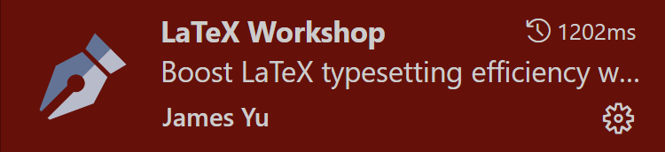

# textemplate-report

To automatically compile LaTeX in Codespaces, install 
the following extensions:

[](https://marketplace.visualstudio.com/items?itemName=James-Yu.latex-workshop)

and run:

```sh
sudo apt update
sudo apt install texlive-full latexmk
```
